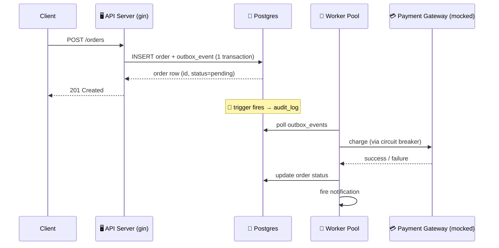

<div align="center">

# 🧾 OrderFlow

### An event-driven order-fulfillment backend, built in Go to actually learn Go.


</div>

---

## 🧠 What is this?

**OrderFlow** is a small but real e-commerce order-fulfillment backend —
built specifically to be a substantial, honest Go learning project instead
of yet another CRUD tutorial. It combines a handful of things that
actually matter in production backend systems into one coherent system:

- 🐘 **PostgreSQL** as the source of truth
- 🟥 **Redis** for caching, rate limiting, and distributed locking
- 📦 **The transactional outbox pattern** — no message broker needed
- 🔌 **A hand-rolled circuit breaker** around a flaky payment gateway
- 👷 **A generic worker pool** decoupled from business logic via a delegator
- 🧾 **Database-trigger-based audit logging** — tamper-resistant by design
- 🖥️ **A single Cobra-powered CLI** running as server, worker, or migrator

> 📓 The full build journal — every decision, every "why," in the order it
> actually happened — lives in [`docs/PROJECT_LOG.md`](docs/PROJECT_LOG.md).
> This README is the front door; that file is the whole story.

---

## 🔄 The core flow



Placing an order never waits on payment — it's persisted and queued in one
atomic step, then processed asynchronously. Every write to
`orders`/`products`/`payments` is captured into `audit_log` by a Postgres
trigger, completely independent of the application code that made it.

---

## 🧱 Tech stack

| Layer | Choice | Why |
|---|---|---|
| Language | **Go 1.25** | Concurrency primitives (goroutines/channels) built for exactly this kind of system |
| HTTP | **Gin** | Middleware chain for auth/rate-limit/metrics/recovery |
| Database | **PostgreSQL 16** via **sqlx** (pgx driver) | ACID, MVCC, JSONB, triggers — raw SQL, no ORM |
| Cache / locks | **Redis 7** | Atomic single-threaded ops — safe rate limiting & locking by construction |
| Migrations | **golang-migrate** | Versioned, replayable schema history |
| CLI | **Cobra** | One binary, three subcommands: `server` / `worker` / `migrate` |
| Resilience | **Hand-rolled circuit breaker** | Built, not imported — the whole point was learning the state machine |
| Local infra | **Podman + podman-compose** | Docker-compatible, no Docker Desktop required |

---

## 📁 Project structure

```
OrderFlow/
├── cmd/                 # Cobra CLI: server, worker, migrate
├── app/                 # AppContext — shared boot dependencies
├── dependencies/        # ServerDependencies / WorkerDependencies
├── contracts/           # Interfaces (ports) — business logic depends on these
├── domains/             # Pure business models (Order, ...)
├── services/            # Use-case orchestration + the event delegator
├── handlers/            # HTTP handlers (gin)
├── routers/             # (reserved for route grouping as the API grows)
├── views/               # (reserved for response DTOs once they diverge from domain models)
├── infra/
│   ├── postgres/        # sqlx pool + repository implementations
│   └── redis/           # Redis client
├── worker/              # Generic worker pool (Job, Handler, Pool)
├── migrations/          # Versioned .sql schema, outbox, and audit-trigger migrations
├── config.yaml           # Server/Postgres/Redis/worker configuration
├── docker-compose.yml    # Postgres + Redis, run via podman-compose
└── docs/PROJECT_LOG.md   # The full build journal
```

This follows a clean/hexagonal split: business logic (`domains`,
`services`) depends only on interfaces (`contracts`), never directly on
infrastructure — so it can be unit-tested with fakes, and infrastructure
can be swapped without touching business rules.

---

## 🚀 Getting started

```bash
# 1. Spin up Postgres + Redis
podman machine init && podman machine start   # first time only
podman-compose up -d

# 2. Apply database migrations (schema, outbox, audit triggers)
go run . migrate up

# 3. Run the API server
go run . server
# -> listening on :8080

# 4. Run the background worker (separate terminal)
go run . worker
# -> worker pool starting, workers=4
```

Check everything's alive:

```bash
curl localhost:8080/healthz
# -> 200 OK (pings both Postgres and Redis)
```

---

## 📡 API

| Method | Path | Description |
|---|---|---|
| `GET` | `/healthz` | Liveness check — pings Postgres **and** Redis |
| `POST` | `/orders` | Create an order |

**Create an order:**

```bash
curl -X POST localhost:8080/orders \
  -H "Content-Type: application/json" \
  -d '{"user_id": "<uuid>", "total_cents": 1999}'
```

```json
{
  "id": "b6601509-b8e3-4321-beaa-74d4799f2289",
  "user_id": "745891e6-f7ad-45a8-9b5a-a034bbb1998e",
  "status": "pending",
  "total_cents": 1999,
  "created_at": "2026-09-15T23:48:43.079459+05:30",
  "updated_at": "2026-09-15T23:48:43.079459+05:30"
}
```

---

## 🗺️ Roadmap

- [x] Config loading, structured logging, graceful shutdown
- [x] Postgres (sqlx) + Redis connections, health checks
- [x] Generic worker pool + service delegator (concurrency core)
- [x] Cobra CLI: `server` / `worker` / `migrate`
- [x] Schema migrations, outbox table, trigger-based audit logging
- [x] `POST /orders` — basic create, no validation
- [ ] Order validation + stock reservation
- [ ] Outbox event write on order creation + outbox dispatcher
- [ ] Hand-rolled circuit breaker around the mock payment gateway
- [ ] Redis-backed rate limiting + cache-aside product reads
- [ ] Users/Auth (JWT + RBAC) and Products domains
- [ ] Prometheus metrics
- [ ] Unit + integration tests

---

## 📓 Why this project exists

Not a tutorial clone — every architectural choice here (the outbox
pattern instead of a message broker, a hand-rolled circuit breaker instead
of a library, database triggers for audit logging instead of application
code, one CLI binary instead of separate binaries) was a deliberate
trade-off made and reasoned about while building it. Read
[`docs/PROJECT_LOG.md`](docs/PROJECT_LOG.md) for the full story, in the
order it happened.

---

<div align="center">

Built with 🐹 Go, ☕ patience, and a genuine amount of `go vet`.

</div>
